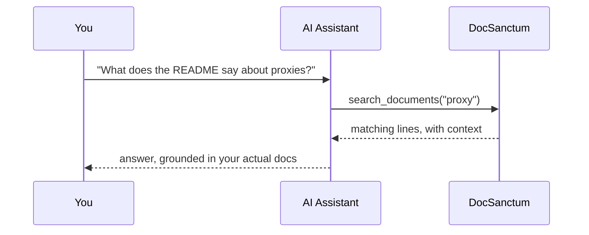

# Using DocSanctum from an AI Assistant

Once your MCP client is pointed at DocSanctum (see the README for setup — Claude Code, Claude Desktop, Cline, Codex CLI, and Gemini CLI are all covered), your registered docs stop being something you have to open and search yourself. You can just ask.

## How it works

## What's exposed

| Tool | What it does |
|---|---|
| `list_documents` | Lists the markdown files in a source, so the assistant knows what exists before reading anything |
| `read_document` | Reads one file's full content |
| `search_documents` | Keyword search — exact matches, with surrounding lines for context |
| `semantic_search_documents` | Meaning-based search — finds relevant passages even when the wording doesn't match |

## Things to try

- "What does this project's README say about running behind a corporate proxy?"
- "Which of my registered repos mention rate limiting?"
- "Summarize the architecture doc in three bullet points."
- "Read the deployment guide and tell me what environment variables it expects."

The assistant picks keyword vs. semantic search on its own depending on the question — a query like `TOKEN_ENCRYPTION_KEY` favors keyword search, while "how do I make search faster" favors semantic. You don't need to specify which.

## Search across everything you've registered

`search_documents` and `semantic_search_documents` default to searching **every** source you've registered — a local folder, three GitHub repos, and a GitLab project all get checked in the same call, with results merged together. You don't have to know (or remember) which repo the answer lives in; ask "which of my repos mention rate limiting?" and DocSanctum checks all of them at once, not just whichever one you happen to have open.

Want to narrow it down instead? Pass `source_id` to search (or read) within just one source.
